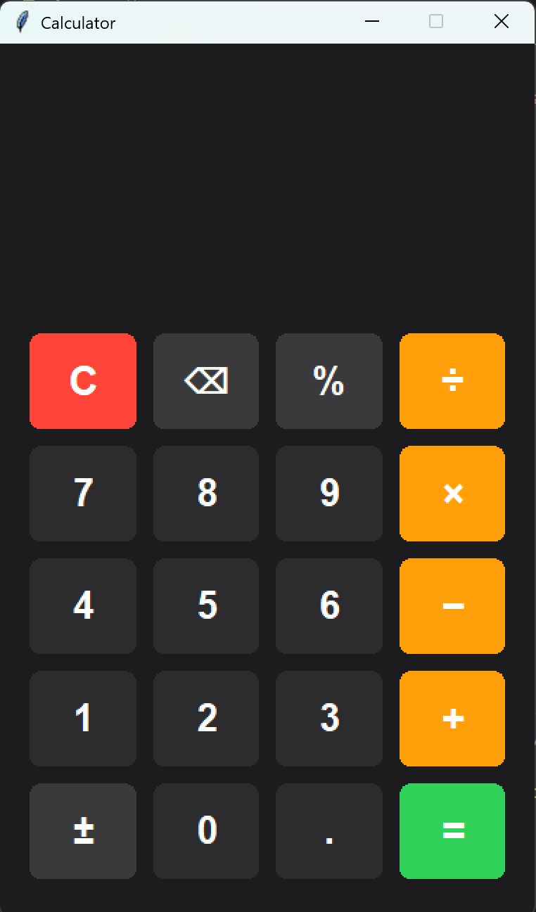

# 🧮 Beautiful Calculator

A stunning, modern calculator built with Python and Tkinter featuring an iOS/macOS-inspired dark theme, smooth rounded buttons, hover effects, and click animations.


---

## 📸 Preview

<!-- Add your screenshot here -->


---

## ✨ Features

- 🎨 **Dark Theme** — Sleek iOS/macOS-inspired design
- 🔵 **Rounded Buttons** — Custom-drawn smooth rounded rectangles
- ✨ **Hover Effects** — Buttons light up on mouse hover
- ⚡ **Click Animation** — White flash animation on button press
- ⌨️ **Keyboard Support** — Full keyboard input support
- 📐 **Auto Font Resize** — Display adapts to long numbers
- 🧮 **Full Arithmetic** — Add, subtract, multiply, divide, percent, negate
- 🛡️ **Error Handling** — Graceful handling of division by zero & invalid input
- 🔙 **Backspace Support** — Delete last digit easily

---

## 🎨 Color Scheme

| Element         | Color                                                              |
|-----------------|--------------------------------------------------------------------|
| Background      |  `#1C1C1E` |
| Number Buttons  |  `#2C2C2E` |
| Operators       |  `#FF9F0A` |
| Equal Button    |  `#30D158` |
| Clear Button    |  `#FF453A` |

---

## ⌨️ Keyboard Shortcuts

| Key              | Action          |
|------------------|-----------------|
| `0-9`            | Input digits    |
| `.`              | Decimal point   |
| `+ - * /`       | Operators       |
| `Enter` or `=`  | Calculate       |
| `Backspace`      | Delete last digit |
| `Escape` or `C` | Clear all       |
| `%`              | Percentage      |

---

## 🚀 Getting Started

### Prerequisites

- **Python 3.7+** — [Download Python](https://www.python.org/downloads/)
- **Tkinter** — Comes pre-installed with Python on most systems

### Installation

1. **Clone the repository**
   ```bash
   git clone https://github.com/arzun4aabara/Calculator.git